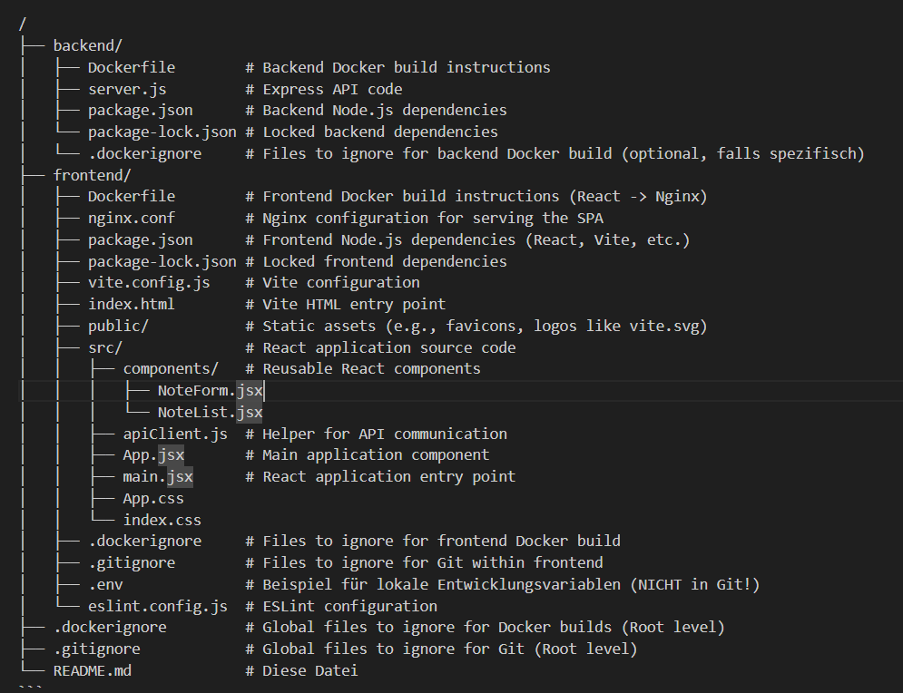

```markdown
# Full-Stack Notizblock (React + Node.js + Docker)

Dies ist eine einfache Full-Stack Notizblock-Anwendung. Sie besteht aus:

*   Einem **React Frontend** (erstellt mit Vite), das Notizen anzeigt, hinzufügt, bearbeitet und löscht.
*   Einem **Node.js/Express Backend** (API), das die Notizdaten verwaltet (in diesem Beispiel im Arbeitsspeicher).

Beide Teile der Anwendung sind containerisiert und laufen in separaten Docker-Containern.

## Projektstruktur

Das Repository ist wie folgt strukturiert (wichtige Dateien):

```

```
*(Hinweis: `node_modules` und `dist` Ordner sind nicht im Diagramm aufgeführt, da sie generiert werden und durch `.gitignore` ignoriert werden sollten.)*

## Voraussetzungen

*   [Docker](https://www.docker.com/get-started) muss installiert sein und laufen.
*   [Node.js und npm](https://nodejs.org/) (werden für die Docker-Builds benötigt, aber nicht zwingend zum reinen Ausführen der Container).
*   [Git](https://git-scm.com/) (um das Repository zu klonen).

## Anwendung bauen und starten (Docker)

Die folgenden Schritte bauen die Docker-Images für Frontend und Backend und starten sie als separate Container.

**1. Images bauen**

Führe diese Befehle im Wurzelverzeichnis des Projekts aus:

*   **Backend Image bauen:**
    ```bash
    # Stelle sicher, dass du im Projekt-Root bist
    docker build -t my-backend-api:0.1.0 -f backend/Dockerfile .
    # Alternativ: cd backend && docker build -t my-backend-api:0.1.0 . && cd ..
    ```

*   **Frontend Image bauen:**
    *   Wir müssen die URL der Backend-API als Build-Argument übergeben. Diese URL muss vom Browser des Benutzers erreichbar sein (daher `localhost` und der gemappte Port `8081`).
    ```bash
    # Stelle sicher, dass du im Projekt-Root bist
    docker build --build-arg VITE_API_URL=http://localhost:8081/api -t my-frontend-app:0.1.0 -f frontend/Dockerfile .
    # Alternativ: cd frontend && docker build --build-arg VITE_API_URL=http://localhost:8081/api -t my-frontend-app:0.1.0 . && cd ..
    ```
    *(Hinweis: Die `-f <pfad>/Dockerfile .` Syntax erlaubt das Bauen aus dem Root-Verzeichnis unter Angabe des Dockerfile-Pfads, was manchmal praktisch ist. Die `cd`-Alternative funktioniert genauso.)*

**2. Container starten**

Stelle sicher, dass die Ports `8080` und `8081` auf deinem Host-System frei sind.

*   **Backend Container starten:**
    *   Dieser Befehl startet die API und leitet Port 8081 deines Hosts auf Port 3000 im Container um (wo die Node.js-App läuft).
    ```bash
    docker run -d -p 8081:3000 --name my-backend my-backend-api:0.1.0
    ```

*   **Frontend Container starten:**
    *   Dieser Befehl startet den Nginx-Server mit der React-App und leitet Port 8080 deines Hosts auf Port 80 im Container um.
    ```bash
    # Stoppe/Entferne ggf. alte Frontend-Container mit diesem Namen
    docker stop my-frontend && docker rm my-frontend || true

    docker run -d -p 8080:80 --name my-frontend my-frontend-app:0.1.0
    ```
    *(`|| true` verhindert einen Fehler, falls der Container nicht existiert)*

## Zugriff auf die Anwendung

Nachdem beide Container gestartet wurden:

*   **Frontend Anwendung:** Öffne deinen Webbrowser und navigiere zu:
    `http://localhost:8080`

*   **Backend API (zum Testen):** Du kannst die API-Endpunkte direkt über den gemappten Host-Port erreichen:
    `http://localhost:8081/api`
    *   Beispiel (alle Notizen abrufen): `http://localhost:8081/api/notes` (kann im Browser oder mit Tools wie `curl` oder Postman getestet werden).

## Beenden

Um die Container zu stoppen:

```bash
docker stop my-frontend my-backend
```

Um die Container zu entfernen (optional, löscht die Container-Instanzen, nicht die Images):

```bash
docker rm my-frontend my-backend
```
```