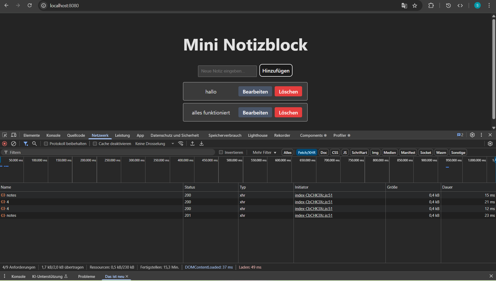
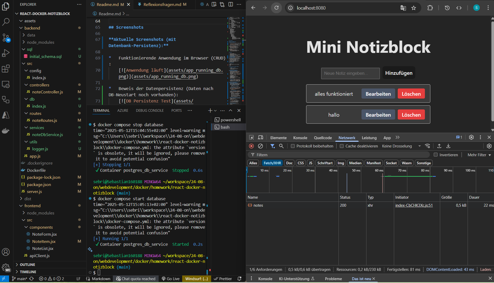
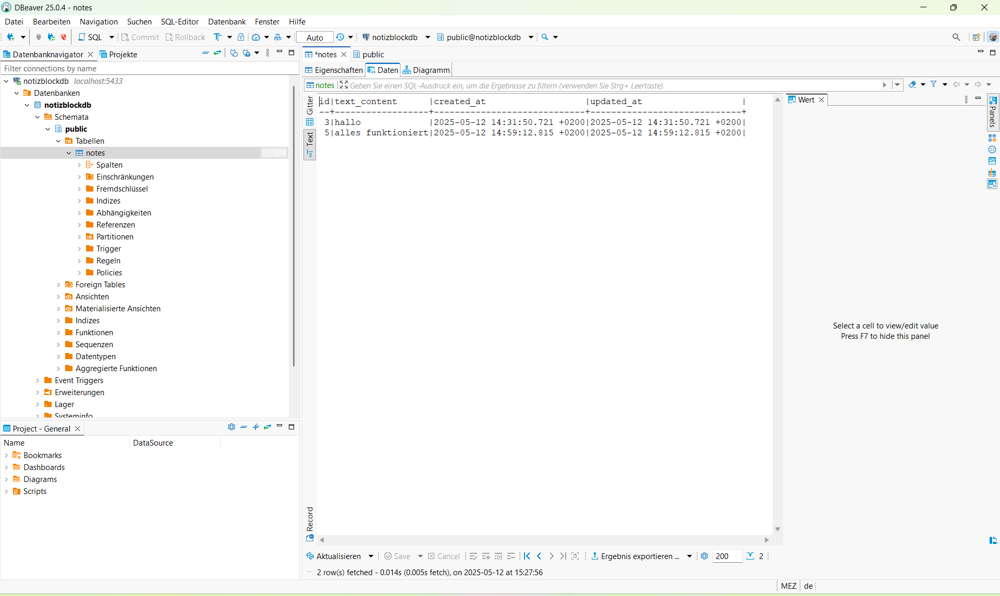
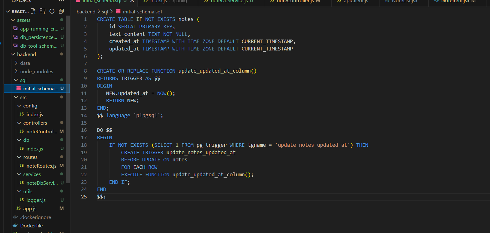

```markdown
# React Docker Notizblock App (Full-Stack mit Docker Compose & PostgreSQL)

Dies ist eine Full-Stack Notizblock-Anwendung, die mit React (Frontend) und Node.js/Express (Backend) erstellt wurde. Die gesamte Anwendung wird mit Docker Compose orchestriert und beinhaltet:
*   Ein Frontend, das mit Vite gebaut und von Nginx als Webserver und Reverse Proxy ausgeliefert wird.
*   Ein Backend, das eine REST-API für Notizen bereitstellt und Daten persistent in einer **PostgreSQL-Datenbank** speichert.
*   Eine PostgreSQL-Datenbank als dedizierter Service.

## Projektstruktur

```text
.
├── .dockerignore
├── .env                  
├── .gitignore
├── README.md             
├── docker-compose.yml
├── sql_schema_and_queries.md 
│
├── backend/
│   ├── .dockerignore
│   ├── Dockerfile
│   ├── package-lock.json
│   ├── package.json
│   ├── server.js
│   ├── sql/                  
│   │   └── initial_schema.sql # 
│   └── src/
│       ├── app.js
│       ├── config/
│       │   └── index.js
│       ├── controllers/
│       │   └── noteController.js
│       ├── db/                 
│       │   └── index.js        
│       ├── routes/
│       │   └── noteRoutes.js
│       ├── services/
│       │   └── noteDbService.js 
│       └── utils/              
│           └── logger.js       
│
└── frontend/
    ├── .dockerignore
    ├── Dockerfile
    ├── index.html
    ├── nginx.conf
    ├── package-lock.json
    ├── package.json
    ├── vite.config.js
    ├── public/
    │   └── vite.svg
    └── src/
        ├── App.css
        ├── App.jsx
        ├── index.css
        ├── main.jsx
        └── components/
            ├── NoteForm.jsx
            ├── NoteItem.jsx
            ├── NoteItem.css    # <-- NEU (falls du CSS-Klassen verwendest)
            └── NoteList.jsx
```

## Screenshots

**Aktuelle Screenshots (mit Datenbank-Persistenz):**

*   Funktionierende Anwendung im Browser (CRUD):
    [](assets/app_running_crud.png)

*   Beweis der Datenpersistenz (Daten nach DB-Neustart noch vorhanden):
    [](assets/db_persistence_test.png)

*    Manuell erstelltes Schema-Skript:
    [](assets/db_tool_schema.png)

*   [](assets/db_script.png)


## Features

*   Notizen anzeigen
*   Neue Notizen hinzufügen
*   Bestehende Notizen bearbeiten (inline)
*   Notizen löschen
*   Backend-Datenpersistenz mittels **PostgreSQL-Datenbank** (über Docker Volume)
*   Datenbankverbindung mit `pg` Treiber und **Connection Pooling**
*   **Sichere API** durch parametrisierte SQL-Abfragen (Schutz vor SQL Injection)
*   Vollständig containerisiert mit Docker: Frontend, Backend, Datenbank.
*   Orchestrierung mit Docker Compose.
*   Frontend mit Nginx Reverse Proxy für API-Aufrufe an das Backend.
*   Logging wichtiger Ereignisse und DB-Verbindungsstatus.

## Voraussetzungen

*   Docker
*   Docker Compose (ist Teil von Docker Desktop)
*   Git

## Setup und Start mit Docker Compose

1.  **Repository klonen:**
    ```bash
    git clone <dein-repository-url>
    cd <projekt-name>
    ```
2.  **(Optional, aber empfohlen) Umgebungsvariablen konfigurieren:**
    Erstelle eine Datei namens `.env` im Wurzelverzeichnis des Projekts (auf derselben Ebene wie `docker-compose.yml`). Docker Compose liest diese Datei automatisch.
    Füge folgenden Inhalt ein (passe die Werte bei Bedarf an, besonders `DB_PASSWORD`):
    ```env
    # .env (Beispielinhalt)
    DB_USER=myuser
    DB_PASSWORD=supersecretpassword
    DB_NAME=notizblockdb
    BACKEND_PORT=3000
    LOG_LEVEL=debug # Optional (z.B. debug, info, warn, error)
    ```
    **Wichtig:** Stelle sicher, dass die `.env`-Datei in deiner `.gitignore`-Datei aufgeführt ist, um zu verhindern, dass sensible Daten in Git committet werden.

3.  **Datenbank-Schema manuell erstellen (Einmalig für diese Aufgabe):**
    Da diese Aufgabe das **manuelle Schema-Management** demonstriert, muss die Tabelle *vor dem ersten vollständigen Start des Backends* erstellt werden.
    *   **a) Nur Datenbank starten:**
        ```bash
        docker compose up -d database
        ```
    *   **b) Warten, bis DB bereit ist:** Überprüfe den Status mit `docker compose ps`, bis bei `postgres_db_service` der Status `(healthy)` angezeigt wird.
        ```bash
        docker compose ps
        ```
    *   **c) Schema anwenden:** Führe das SQL-Skript im laufenden DB-Container aus (ersetze `myuser` und `notizblockdb` falls du andere Werte in `.env` nutzt):
        ```bash
        docker exec -i postgres_db_service psql -U myuser -d notizblockdb < backend/sql/initial_schema.sql
        ```
        *(Bei Erfolg sollten keine Fehler, sondern Meldungen wie CREATE TABLE, NOTICE etc. erscheinen).*

4.  **Gesamte Anwendung bauen und starten:**
    Führe im Wurzelverzeichnis des Projekts folgenden Befehl aus:
    ```bash
    docker compose up --build -d
    ```
    *   `--build`: Baut die Images neu (wichtig nach Code-Änderungen).
    *   `-d`: Startet die Container im Detached-Modus (im Hintergrund).

5.  **Status überprüfen:**
    Überprüfe erneut den Status aller Container:
    ```bash
    docker compose ps
    ```
    Alle Services (`frontend_web_app`, `backend_api_service`, `postgres_db_service`) sollten laufen (`Up` oder `running`).

6.  **Anwendung im Browser aufrufen:**
    Öffne deinen Webbrowser und gehe zu `http://localhost:8080`.

## Funktionalität Testen

1.  **CRUD:** Füge Notizen hinzu, bearbeite sie und lösche sie über das Frontend.
2.  **Persistenz:**
    *   Erstelle einige Notizen.
    *   Stoppe den Datenbank-Container: `docker compose stop database`
    *   Starte ihn wieder: `docker compose start database`
    *   Lade die Anwendung im Browser neu (`http://localhost:8080`). Die Notizen sollten immer noch vorhanden sein.

## Wichtige Services und Ports

*   **Frontend (Nginx):** Erreichbar unter `http://localhost:8080`. Leitet API-Anfragen (`/api/*`) an das Backend weiter.
*   **Backend (Node.js API):** Lauscht intern im Docker-Netzwerk auf Port 3000 (oder `BACKEND_PORT`). **Verbindet sich mit dem `database`-Service** für Datenoperationen.
*   **Datenbank (PostgreSQL):** Lauscht intern auf Port 5432. Ist optional auf Host-Port `5433` gemappt für direkten Zugriff mit DB-Tools. Speichert Daten im benannten Volume `postgres_data`.

## Logs anzeigen

*   Logs aller Services: `docker compose logs`
*   Logs des Backends: `docker compose logs backend` (Zeigt DB-Verbindungsversuche, SQL-Fehler etc.)
*   Logs des Frontends (Nginx): `docker compose logs frontend`
*   Logs der Datenbank: `docker compose logs database`
*   Live-Verfolgung (z.B. Backend): `docker compose logs -f backend`

## Anwendung stoppen

*   Container stoppen: `docker compose stop`
*   Container stoppen & entfernen (Daten im DB-Volume bleiben): `docker compose down`
*   Container stoppen, entfernen & **DB-Volume löschen** (ACHTUNG: Datenverlust!): `docker compose down -v`

## SQL Recap & Datenmodell

Eine theoretische Ausarbeitung eines relationalen Datenbankmodells befindet sich in der Datei `sql_schema_and_queries.md`. Das **tatsächliche initiale Schema**, das für diese Aufgabe manuell angewendet wird, befindet sich in `backend/sql/initial_schema.sql`.

## Code-Qualität und Konventionen

*   **Sicherheit:** Es werden parametrisierte Abfragen verwendet, um SQL Injection zu verhindern.
*   **Module:** Das Backend verwendet ES-Module (`import`/`export`).
*   **.gitignore / .dockerignore:** 
```